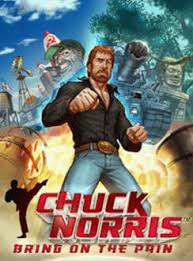
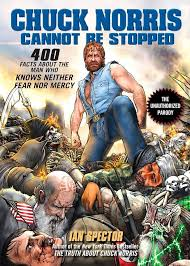

# Chuck Norris Joke Generator

A fun web app that generates random Chuck Norris jokes and changes the background image each time a new joke is fetched. This project uses the Chuck Norris API to deliver hilarious jokes, with a dynamic background to keep things exciting!

## Features
- Fetches a random Chuck Norris joke from the [Chuck Norris API](https://api.chucknorris.io/).
- Randomly changes the background image with every new joke (3 images to choose from).
- Simple and intuitive interface with a button to get a new joke.

## Screenshots
Here are the 3 random Chuck Norris images that will be displayed as the background:

1. 
2. 
3. 

## Demo
You can view the live demo [here](https://kaankst.github.io/websiteapii/). (https://kaankst.github.io/websiteapii/)

## Acknowledgments

- [Chuck Norris API](https://api.chucknorris.io/) for providing the jokes.
- This project was inspired by the need for some humor and Chuck Norris' legendary status.

